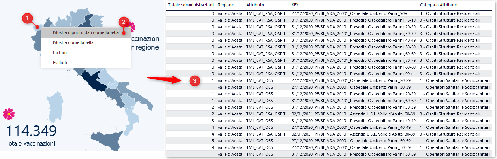

⚠⚠ **NOTA BENE**: da giorno 8 gennaio 2020 non ne cureremo più l'estrazione

## Dati di dettaglio sulle somministrazioni per regione

La [*dashboard* sui vaccini](https://app.powerbi.com/view?r=eyJrIjoiMzg4YmI5NDQtZDM5ZC00ZTIyLTgxN2MtOTBkMWM4MTUyYTg0IiwidCI6ImFmZDBhNzVjLTg2NzEtNGNjZS05MDYxLTJjYTBkOTJlNDIyZiIsImMiOjh9), consente al 1️⃣ click con il tasto destro del mouse su una regione, di selezionare l'opzione 2️⃣ "Mostra il punto dati come tabella" e avere dei 3️⃣ dati disaggregati.



Il formato con cui sono esposti sul web è il JSON, e sono disponibili per ogni regione in [questa cartella](https://github.com/ondata/covid19italia/tree/master/webservices/vaccini/processing/datiRegioni) (il nome file corrisponde al [codice regionale ISTAT](#codici-istat-regioni)).

Hanno una struttura complessa, con due sezioni principali: una dedicata ai dati, espressi con dei codici numerici, ed una con dei dizionari controllati per risolvere il significato di questi.

Qui sotto un esempio della forma dei dati (qui trasformati nel più leggibile JSONlines):

```json
{"C":[1,1,10,1],"R":2}
{"C":[11],"R":23}
{"C":[19],"R":23}
{"C":[23],"R":23}
{"C":[2,20],"R":22}
{"C":[3,5,2],"R":3}
{"C":[3,1,21,1],"R":2}
{"C":[4,12],"R":22}
```

Qui 4 dizionari di esempio:

```json
["Valle d'Aosta"]
["TML_CAT_ALTRO","TML_CAT_OSS","TML_CAT_PERSONALE","TML_CAT_RSA_OSPITI"]
["02/01/2021_PF/BT_VDA_20101_Azienda U.S.L. Valle d'Aosta_16-19","02/01/2021_PF/BT_VDA_20101_Azienda U.S.L. Valle d'Aosta_20-29","02/01/2021_PF/BT_VDA_20101_Azienda U.S.L. Valle d'Aosta_30-39","02/01/2021_PF/BT_VDA_20101_Azienda U.S.L. Valle d'Aosta_40-49","02/01/2021_PF/BT_VDA_20101_Azienda U.S.L. Valle d'Aosta_50-59","02/01/2021_PF/BT_VDA_20101_Azienda U.S.L. Valle d'Aosta_60-69","02/01/2021_PF/BT_VDA_20101_Azienda U.S.L. Valle d'Aosta_70-79","02/01/2021_PF/BT_VDA_20101_Azienda U.S.L. Valle d'Aosta_80-89","02/01/2021_PF/BT_VDA_20101_Azienda U.S.L. Valle d'Aosta_90+","27/12/2020_PF/BT_VDA_20001_Ospedale Umberto Parini_16-19","27/12/2020_PF/BT_VDA_20001_Ospedale Umberto Parini_20-29","27/12/2020_PF/BT_VDA_20001_Ospedale Umberto Parini_30-39","27/12/2020_PF/BT_VDA_20001_Ospedale Umberto Parini_40-49","27/12/2020_PF/BT_VDA_20001_Ospedale Umberto Parini_50-59","27/12/2020_PF/BT_VDA_20001_Ospedale Umberto Parini_60-69","27/12/2020_PF/BT_VDA_20001_Ospedale Umberto Parini_70-79","27/12/2020_PF/BT_VDA_20001_Ospedale Umberto Parini_80-89","27/12/2020_PF/BT_VDA_20001_Ospedale Umberto Parini_90+","31/12/2020_PF/BT_VDA_20101_Presodio Ospedaliero Parini_16-19","31/12/2020_PF/BT_VDA_20101_Presodio Ospedaliero Parini_20-29","31/12/2020_PF/BT_VDA_20101_Presodio Ospedaliero Parini_30-39","31/12/2020_PF/BT_VDA_20101_Presodio Ospedaliero Parini_40-49","31/12/2020_PF/BT_VDA_20101_Presodio Ospedaliero Parini_50-59","31/12/2020_PF/BT_VDA_20101_Presodio Ospedaliero Parini_60-69","31/12/2020_PF/BT_VDA_20101_Presodio Ospedaliero Parini_70-79","31/12/2020_PF/BT_VDA_20101_Presodio Ospedaliero Parini_80-89","31/12/2020_PF/BT_VDA_20101_Presodio Ospedaliero Parini_90+"]
["2 - Personale non Sanitario","1 - Operatori Sanitari e Sociosanitari","3 - Ospiti Strutture Residenziali"]
```

Non abbiamo trovato una documentazione di questa struttura di JSON e inizialmente ci stavamo limitando soltanto a raccoglierli e archiviarli.<br>
Poi grazie al contributo e alla spinta di [**Paolo Milan**](https://twitter.com/OpencovidM) e sopratutto al lavoro di decodifica e interpretazione della struttura dei JSON a cura di [**Lorenzo Vegro**](https://twitter.com/ProcessNamed), abbiamo attivato un lavoro di trasformazione in formato più leggibile da persone e *personal computer*. Un grazie sentito a entrambi.

Sono pubblicati in [questa cartella](./) in formato CSV con (al momento) la struttura sottostante di esempio di base, conforme pienamente in termini di contenuti ai file JSON di *input*. Di grande interesse la colonna `identificativo`, che sembra contenere: la data di riferimento, il luogo in cui si è somministrato il vaccino e la fascia di età.<br>
Disaggregandoli e riunendoli si possono ottenere dati ad oggi non pubblicati (come le fasce di età per regione).

| somministrazioni | regione | siglaCategoria | identificativo | categoria | codice_regione | data | vaccino | punto | classeEta | siglaRegione | NUTS2 |
| --- | --- | --- | --- | --- | --- | --- | --- | --- | --- | --- | --- |
| 13 | Lazio | TML_CAT_OSS | 11/01/2021_PF/BT_LAZ_120920_Centro Vaccinale UOSD Medicina del Lavoro - UOC Malattie infettive_20-29 | 1 - Operatori Sanitari e Sociosanitari | 12 | 2021-01-11 | PF/BT | 120920_Centro Vaccinale UOSD Medicina del Lavoro - UOC Malattie infettive | 20-29 | LAZ | ITI4 |
| 1 | Trentino-Alto Adige | TML_CAT_ALTRO | 05/01/2021_PF/BT_PAB_41006_Ospedale di Base di Vipiteno_30-39 | 2 - Personale non Sanitario | 04 | 2021-01-05 | PF/BT | 41006_Ospedale di Base di Vipiteno | 30-39 | PAB | ITH1 |
| 2 | Campania | TML_CAT_ALTRO | 05/01/2021_PF/BT_CAM_15016600_P.O. S. MARIA DELLA SPERANZA BATTIPAGLIA_40-49 | 2 - Personale non Sanitario | 15 | 2021-01-05 | PF/BT | 15016600_P.O. S. MARIA DELLA SPERANZA BATTIPAGLIA | 40-49 | CAM | ITF3 |
| 2 | Sicilia | TML_CAT_OSS | 08/01/2021_PF/BT_SIC_19020770_Casa di Riposo Maria Santissima - Comiso_60-69 | 1 - Operatori Sanitari e Sociosanitari | 19 | 2021-01-08 | PF/BT | 19020770_Casa di Riposo Maria Santissima - Comiso | 60-69 | SIC | ITG1 |
| 3 | Marche | TML_CAT_PERSONALE | 11/01/2021_PF/BT_MAR_11090501_Az.Osp. Riuniti di Ancona_60-69 | 2 - Personale non Sanitario | 11 | 2021-01-11 | PF/BT | 11090501_Az.Osp. Riuniti di Ancona | 60-69 | MAR | ITI3 |

**NOTA BENE**: i dati estratti e presenti in questo *repository*, sono ricavati interrogando le API non documentate della *dashboard*. Non sono stati resi palesemente accessibili; i dati aperti ufficiali sono quelli pubblicati [qui](https://github.com/italia/covid19-opendata-vaccini), che ad oggi (15 gennaio 2021) non contengono questi dati di dettaglio. Inoltre la nostra procedura di estrazione potrebbe contenere degli errori.

## Note

Ci preme sottolineare due elementi:

- **non siamo certi della corretta interpretazione della struttura dei JSON** e della loro trasformazione in formato CSV;
- per ottenere questi dati interroghiamo le **API** della piattaforma usata per la *dashboard*, in cui **c'è un limite a 30.000 *record* di *output***. Presto quindi è probabile che verrà superato e non sarà possibile più aggiungere nuovi dati.


## Codici ISTAT regioni

| codice_regione | regione |
| --- | --- |
| 01 | Piemonte |
| 02 | Valle d'Aosta |
| 03 | Lombardia |
| 04 | Trentino-Alto Adige |
| 05 | Veneto |
| 06 | Friuli-Venezia Giulia |
| 07 | Liguria |
| 08 | Emilia-Romagna |
| 09 | Toscana |
| 10 | Umbria |
| 11 | Marche |
| 12 | Lazio |
| 13 | Abruzzo |
| 14 | Molise |
| 15 | Campania |
| 16 | Puglia |
| 17 | Basilicata |
| 18 | Calabria |
| 19 | Sicilia |
| 20 | Sardegna |

---

A cura dell'[**associazione onData**](https://ondata.it/)
